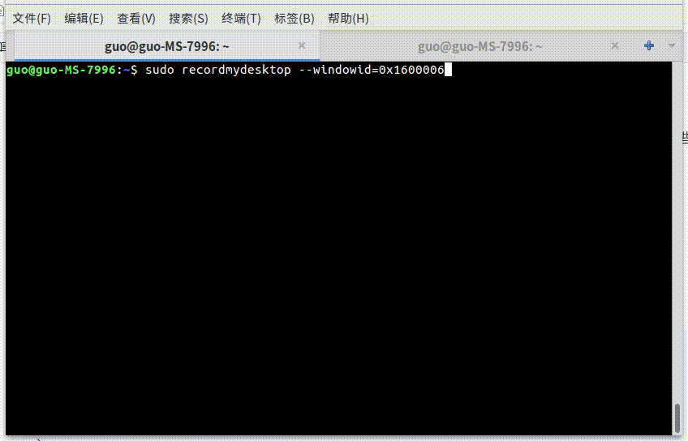

#### 简介
flag库是标准库的增强版本,让你的命令行程序飞起来

[](https://travis-ci.org/guonaihong/flag)
#### 演示

### 功能
* [兼容go标准库](#兼容go标准库)
* [数组类型选项](#数组类型选项)
* [多选项支持](#多选项支持)
* [MatchVar](#matchvar)
* [posix风格](#posix风格)
* [子母命令](#子母命令)
* [泛型接口函数](#泛型接口函数)
* [绑定结构体](#绑定结构体)

#### 兼容go标准库 
```golang
package main

import (
    "fmt"
    "github.com/guonaihong/flag"
)

func main() {
    op := flag.String("dir", "", "open dir")
    flag.Parse()
    fmt.Printf("op = %s\n", *op)
}
// 运行
// go run main.go -dir test.file
// 输出
// op = test.file
```

#### 数组类型选项
很方便写出curl -H选项效果
```golang
package main

import (
    "fmt"
    "github.com/guonaihong/flag"
)

func main() {
    h := flag.StringSlice("H, header", []string{}, "http header")
    flag.Parse()
    fmt.Printf("%#v\n", *h)
}

// 运行
// go run main.go -H "appkey:123" -H "User-Agent: main" --header "Accept: */*"
// 输出
// []string{"appkey:123", "User-Agent: main", "Accept: */*"}
```
#### 多选项支持
```golang
package main

import (
	"fmt"
	"github.com/guonaihong/flag"
)

func main() {
	long := flag.String("l, long", "", "short long option")
	flag.Parse()
	fmt.Printf("long = %s\n", *long)
}

// 运行
// go run main.go -l hello
// go run main.go -long hello
// 输出
// long = hello
```
#### matchvar
详情 [#9](https://github.com/guonaihong/flag/issues/9)
很多时候使用bool选项，都是命令行传递bool选项 代码里面设置一个默认值，如下。
```go
var openNull bool
delimiter := byte('\n')
command.Opt("0, null", "end each output line with NUL, not newline").
                Flags(flag.Posix).
                Var(&openNull)
if openNull {
    delimiter = byte(0)
}
```

现在可以使用MatchVar函数简化类似代码，如果命令函数传递-0或者-null，delimiter的值为'\n'
```go
package main

import (
        "fmt"
        "github.com/guonaihong/flag"
)

func main() {

        delimiter := byte(0)

        flag.Opt("0, null", "end each output line with NUL, not newline").
                Flags(flag.Posix).
                MatchVar(&delimiter, byte('\n'))
        flag.Parse()

        fmt.Printf("%d\n", delimiter)
}

// 运行
// go run main.go -0
// 输出
// 10
```

#### posix风格
* 命令组合
```golang
package main

import (
    "fmt"
    "github.com/guonaihong/flag"
)

func main() {
    showEnds := flag.Opt("E, show-end", "display $ at end of each line").
        Flags(flag.PosixShort).NewBool(false)

    showTabs := flag.Opt("T, show-tabs", "display TAB characters as ^I").
        Flags(flag.PosixShort).NewBool(false)

    flag.Parse()
    fmt.Printf("showEnds:%t, showTabs:%t\n", *showEnds, *showTabs)
}

// 运行
// go run main.go -TE
// 输出
// showEnds:true, showTabs:true
```
* 贪婪模式
```golang
package main

import (
	"fmt"
	"github.com/guonaihong/flag"
)

func main() {
	var heads []string

	flag.Opt("H, header", "Pass custom header LINE to server (H)").
		Flags(flag.GreedyMode).Var(&heads)

	flag.Parse()
	fmt.Printf("%#v\n", heads)
}

// 运行
// go run main.go -H appkey:test  hello:world love:you
// 输出
// []string{"appkey:test", "hello:world", "love:you"}
```
* -vvv 或者-v -v -v
```go

package main

import (
        "fmt"
        "github.com/guonaihong/flag"
)

func main() {
        var bs []bool

        flag.Opt("v", "test bool slice").Flags(flag.PosixShort).Var(&bs)

        flag.Parse()

        switch len(bs) {
        case 0:
                fmt.Printf("No verbose info\n")
        case 1:
                fmt.Printf("Some verbose info\n")
        case 2:
                fmt.Printf("Tons of verbose info\n")
        default:
                fmt.Printf("别闹了\n")
        }

}

// 运行
// go run main.go -v
// 输出
// Some verbose info

// 运行
// go run main.go -vv
// 输出
// Tons of verbose info

// 运行
// go run main.go -vvv
// 输出
// 别闹了

```
#### 子母命令
如果要实现一个主命令包含3个子命令(http, websocket, tcp)，其中http子命令又包含5个命令行选项，可以使用如下用法
``` golang
package main

import (
	"fmt"
	"github.com/guonaihong/flag"
	"os"
)

type httpOption struct {
	Header     []string
	Forms      []string
	FormString string
	Url        string
	Data       string
}

type wsOption struct {
	Ac int
	An int
}

type streamOption struct {
}

func main() {
	parent := flag.NewParentCommand(os.Args[0])

	parent.SubCommand("http", "Use the http subcommand", func() {
		argv0 := os.Args[0]
		argv := parent.Args()

		command := flag.NewFlagSet(argv0, flag.ExitOnError)

		ho := httpOption{}

		command.Opt("H, header", "Pass custom header LINE to server (H)").Var(&ho.Header)
		command.Opt("F, form", "Specify HTTP multipart POST data (H)").Var(&ho.Forms)
		command.Opt("form-string", "Specify HTTP multipart POST data (H)").Var(&ho.Forms)
		command.Opt("url", "Specify a URL to fetch").Var(&ho.Url)
		command.Opt("d, data", "HTTP POST data").Var(&ho.Data)

		command.Parse(argv)
	})

	parent.SubCommand("ws, websocket", "Use the websocket subcommand", func() {
		argv := parent.Args()
		command := flag.NewFlagSet(os.Args[0], flag.ExitOnError)

		wo := wsOption{}

		command.Opt("an", "Number of requests to perform").DefaultVar(&wo.An, 1)
		command.Opt("ac", "Number of multiple requests to make").DefaultVar(&wo.Ac, 1)

		command.Parse(argv)

		fmt.Printf("option = %#v\n", wo)
	})

	parent.SubCommand("tcp, udp", "Use the tcp or udp subcommand", func() {
		//conn.Main(os.Args[0], parent.Args())
	})

	parent.Parse(os.Args[1:])
}

// 运行帮助信息
// go run main.go -h
// 输出
// Usage of /tmp/go-build387723503/b001/exe/main:
//  http             Use the http subcommand
//  tcp, udp         Use the tcp or udp subcommand
//  ws, websocket    Use the websocket subcommand

// 运行websocket子命令帮助信息
// go run 
// Usage of /tmp/go-build229109289/b001/exe/main:
//  -ac int
//    	Number of multiple requests to make
//  -an int
//    	Number of requests to perform

// 运行websocket子命令
// go run main.go websocket -ac 2 -an 2
// 输出
// option = main.wsOption{Ac:2, An:2}
```
#### 泛型接口函数

```golang
package main

import (
	"fmt"
	"github.com/guonaihong/flag"
	_ "os"
)

type TestOption struct {
	Int     int
	Int64   int64
	Strings []string
	Int64s  []int64

	Int2 int
}

func main() {
	option := TestOption{}

    // DefaultVar是带默认值的泛型函数
    // Var是不带默认值的泛型函数
	flag.Opt("i, int", "test int").DefaultVar(&option.Int, 0)
	flag.Opt("i64, int64", "test int64").DefaultVar(&option.Int64, int64(0))
	flag.Opt("s, strings", "test []string").DefaultVar(&option.Strings, []string{})
	flag.Opt("i64s, int64s", "test []int64").DefaultVar(&option.Int64s, []int64{})
	flag.Opt("i2", "test int2").Var(&option.Int2)
	flag.Parse()

	fmt.Printf("%#v\n", option)
}

// 运行
// go run main.go -i 3 -i64 64 -i64s 64 -i64s 1 -i64s 2 -i64s 3 -s a -s b -s c
// 输出
// main.TestOption{Int:3, Int64:64, Strings:[]string{"a", "b", "c"}, Int64s:[]int64{64, 1, 2, 3}, Int2:0}
```

#### 绑定结构体
```golang
package main

import (
	"fmt"
	"github.com/guonaihong/flag"
	_ "os"
)

type TestOption struct {
	Int     int      `opt:"i, int" usage:"test int"`
	Int64   int64    `opt:"i64, int64" usage:"test int64"`
	Strings []string `opt:"s, strings" usage:"test []string"`
	Int64s  []int64  `opt:"i64s, int64s" usage:"test []int64"`

	Int2 int `opt:"i2" usage:"test int2"`
}

func main() {
	option := TestOption{}

	flag.ParseStruct(&option)

	fmt.Printf("%#v\n", option)
}

// 运行
// go run main.go -i 3 -i64 64 -i64s 64 -i64s 1 -i64s 2 -i64s 3 -s a -s b -s c
// 输出
// main.TestOption{Int:3, Int64:64, Strings:[]string{"a", "b", "c"}, Int64s:[]int64{64, 1, 2, 3}, Int2:0}
```
